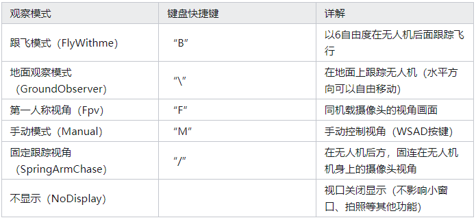

# Airsim Learn

[官网链接](https://microsoft.github.io/AirSim/)

[宁子安airsim&unreal专栏](https://www.zhihu.com/column/multiUAV)

网上诸多文章都是使用python的API来使用Airsim的，后面研究之后可以出一点使用C++的API的文章

## Airsim基础概念知识

||Unreal|Airsim|
|--|--|--|
|长度单位|厘米|米|
|坐标系|左手|右手|

全局坐标系：
x、y、z轴分别对应北、东、地方向；

机体坐标系：
x、y、z轴分别对应无人机的前、右、下方向；

## Airsim API

观察视角控制：


飞到指定位置：
moveToPositionAsync

速度控制：

```c
moveByVelocityZAsync(
         self,
         vx,
         vy,
         z,
         duration,
         drivetrain=DrivetrainType.MaxDegreeOfFreedom,
         yaw_mode=YawMode(),
         vehicle_name="",
     )
```

四旋翼是一个非线性系统，给一个速度指令，它是不可能瞬时达到的，而且这个速度指令与当前的速度之差越大，到达这个速度指令的调节时间就越长。

[api总结](https://zhuanlan.zhihu.com/p/340774859) 