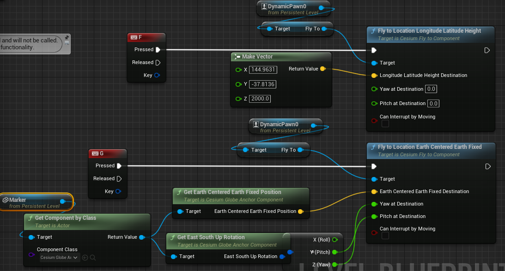

# Cesium for Unreal

<https://cesium.com/platform/cesium-for-unreal/>

- [ ] Getting Started
  - [x] Quickstart
    - [x] Cesium ion simple tutorial
    - [x] create, add globe, explore
  - [x] Add datasets
  - [x] Placing Objects on the Globe
  - [x] Build global scenes with georeferenced sublevels
  - [x] Transition between locations on the globe
  - [x] Photorealistic 3D Tiles in Cesium for Unreal
  - [x] Using Cesium ion Self-Hosted
- [ ] Create interactive experiences
- [ ] Build worlds
- [ ] Technical Reference
- [ ] Tutorials by Epic Games
  - [ ] A DIY Flight Simulator tutorial
- [ ] 开源项目：https://github.com/DuGuYifei/DroneSimulatorMonitor

Cesium ion is an open platform for streaming and hosting 3D content, and includes global, curated data that you can use to create your own real-world applications.

Dealing with the unfortunate reality of a round planet requires employing one of the following techniques, in order from simplest to most complex:

1. Stay within a relatively small area, probably a hundred kilometers or so.
2. Set up independent sublevels, each with their own CesiumGeoreference, in each part of the globe that is of interest. This technique is described in the Building Global Scenes with Sublevels tutorial.
3. Use the CesiumGlobeAnchorComponent to add limited globe-awareness to any Unreal Actor (see "We can turn dynamic objects into georeferenced objects" below).
4. Manually extend your game objects to be fully aware of the round Earth.

## Transition between locations on the globe

It’s not always convenient to type in starting and ending WGS84 coordinates to specify a flight. As an alternative, actors can be placed in a scene to serve as "geo-markers”. These markers can be placed at any geographic location, and their position can later be used as the Dynamic Pawn's flight destination.

