# Linux基础知识

[toc]

## Linux简介

### 版本

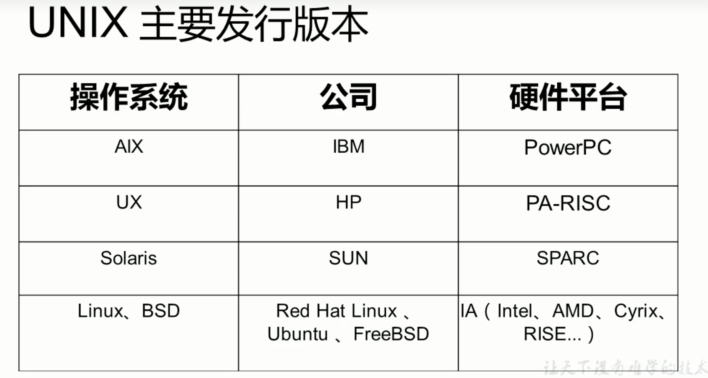

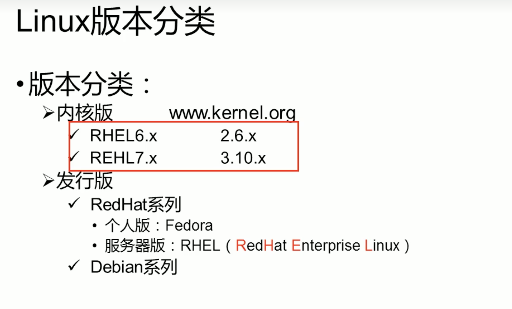

Ubuntu不适合服务器，多用基于RHEL的CentOS

### 开源软件简介

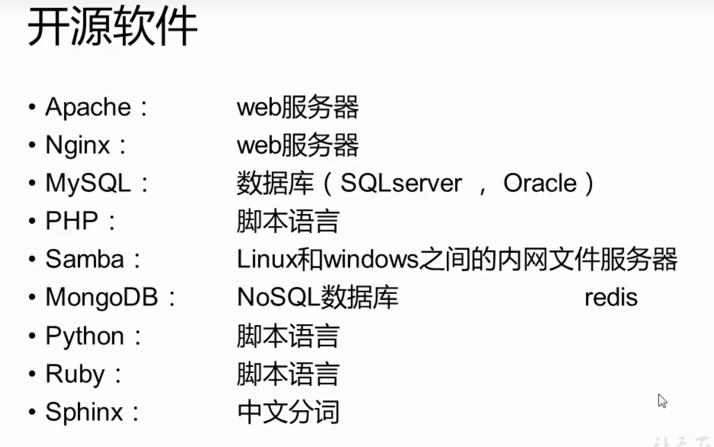

支撑互联网的开源技术：

- LAMP
  - Linux 操作系统
  - Apache Web服务器， Nginx
  - MySQL 数据库
  - PHP 编程语言

### 应用领域

可使用[www.netcraft.com](https://www.netcraft.com/)扫描网站服务器技术
> 未使用成功

全世界的大网站服务器基本都是用的Linux

电影领域

嵌入式领域

安卓底层是linux内核，IOS底层是Unix内核

## Linux安装

CentOS 6.x
<http://www.centos.org/>

使用VMWare10 安装CentOS 6.8

- 虚拟机
  - 快照：创建和管理快照-可快速恢复快照状态
  - 克隆：链接克隆，完整克隆。可复制一个镜像，相当于两个虚拟机
  - 网络设置：
    - 桥接-使用本地网卡通信
    - NAT-使用虚拟网卡8
    - 仅主机模式-使用虚拟网卡1
  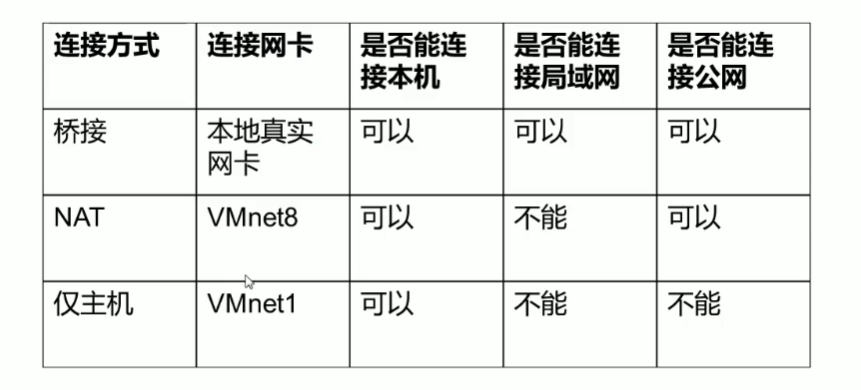

- 分区和格式化
  - MBR分区表：最大支持2.1TB硬盘，最多支持4个分区
    - 主分区最多只能有4个
    - 扩展分区：每块硬盘最多只能有1个，主分区加扩展分区最多有4个，不能写入数据，只能包含逻辑分区
  - 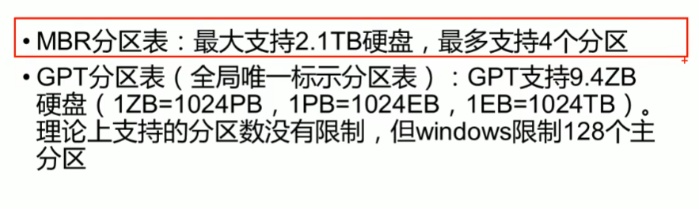
- 设备文件名和挂载点
  - /dev/sdb5: 第二块SATA接口硬盘的第一个逻辑分区
  - 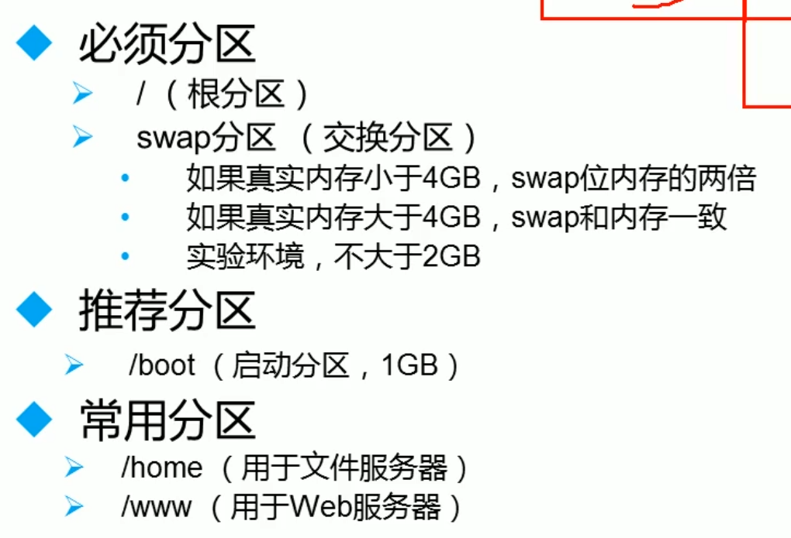
  - 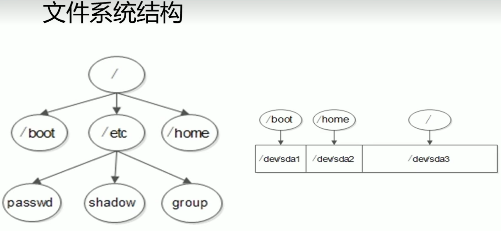
- 安装
  - 建议修改主机名，但是初学时不建议修改
- IP配置
  - 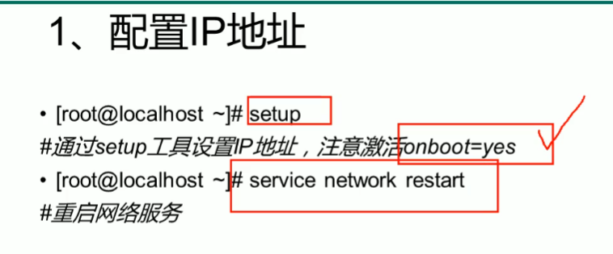
  - 远程工具 Xshell WinSCP
  - 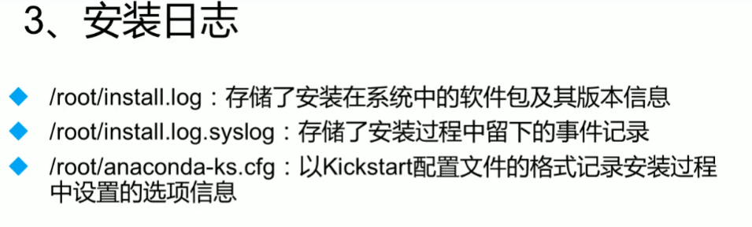

## 初学者建议

### 注意事项

1. Linux严格区分大小写
2. Linux一切皆文件，硬件设备也是文件，Linux的设备文件保存在/dev/目录中
3. Linux不靠扩展名区分文件类型
   1. 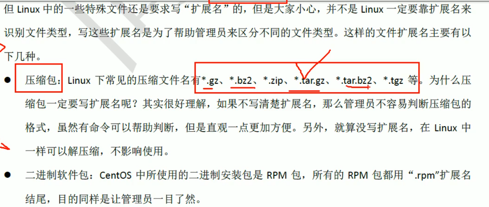
   2. 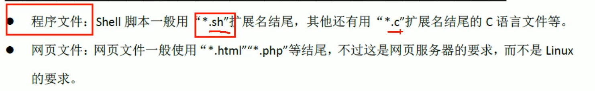
4. Linux中所有的存储设备都必须在挂载之后才能使用
   1. 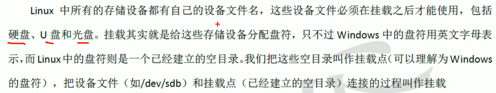
5. Windows下的程序不能直接在Linux中使用

### 一级目录作用

