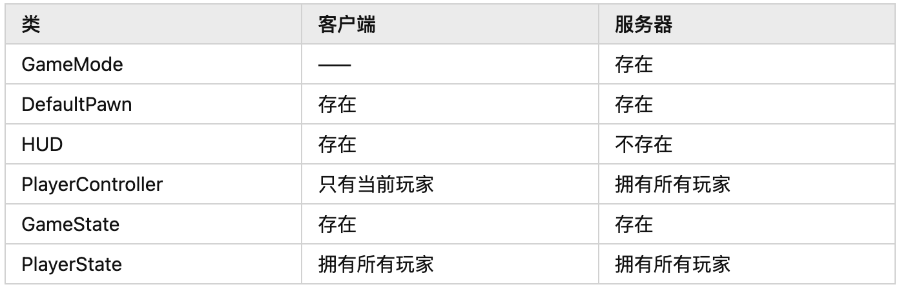
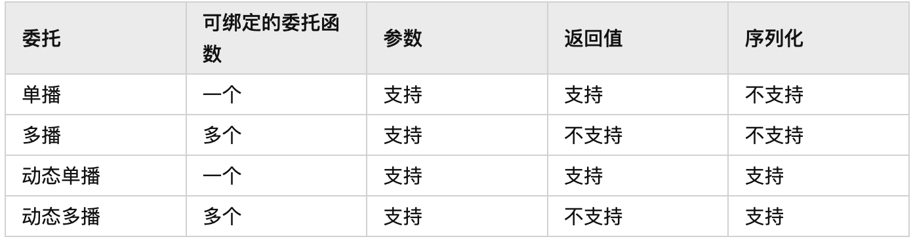
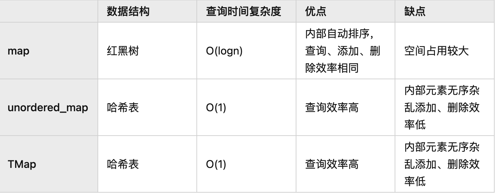

# Interview About

[toc]

## 一些资料

[UE4游戏客户端开发进阶学习指南](https://zhuanlan.zhihu.com/p/659805638)

## UE4客户端面试题

### 1.游戏模式和游戏实例

- GameInstance：游戏实例，架构上凌驾于最顶端，实例里的数据不会随着关卡的切换而消失。作用是为游戏保存临时的全局数据，或者自定义需要在全局使用的逻辑。在“项目设置 - 项目 - 地图和模式 - 游戏实例 - 游戏实例类”处修改。游戏运行时蓝图使用“GetGameInstance”节点获取，C++ 使用“UGameplayStatics::GetGameInstance()”函数获取。
- GameMode：设置游戏规则，在当前地图内生效。它可以规定玩家和观众数量，以及制定玩家进入游戏的方式，包含 Spawn 地点和生成/重生等行为的规则。联网状态下，只存在于服务端，客户端不能访问。在“项目设置 - 项目 - 地图和模式 - 默认模式 - 默认游戏模式”或“世界场景设置 - 游戏模式 - 游戏模式重载”或“Config - DefaultEngine.ini - GameMapsSettings - GlobalDefaultGameMode”处均可修改。
- DefaultPawn：角色的外在表现类，是玩家在游戏中的物理代表，可包含自身的移动规则和其他游戏逻辑，服务端和客户端都存在一份，同时保持同步。在 GameMode 中修改。
HUD：是显示屏幕上覆盖元素的基本对象。游戏中每个由人类控制的玩家都有自己的AHUD类实例，这个实例会绘制到个人视口上。只存在于客户端。在 GameMode 中修改。
- PlayerController：非常重要的一个类，拥有 Pawn 并设置其行为规则，服务器上拥有所有玩家的PlayerController，而本地客户端则只有当前玩家的 - PlayerController 。关联了客户端和服务端，通过该类，客户端可以向服务端发送请求。在 GameMode 中修改。
- GameState：数据的全局管理，服务端和客户端都存在一份，它包含要复制到游戏中的每个客户端的信息，通常包含游戏分数、比赛是否已开始和基于世界场景玩家人数要生成的AI数量等的信息，以及其他特定于游戏的信息。通常用来保持数据的同步，也可将其中的部分数据设置为不同步。在 GameMode 中修改。
- PlayerState：角色数据，该类需要通过 PlayerController 来访问。PlayerState 中保存当前玩家的一些信息，例如玩家姓名或得分、当前等级及生命值等，是对应玩家的数据容器。对于多人游戏，所有玩家的 PlayerState存在于所有机器上（与 PlayerController 不同），并且可以将数据从服务器复制到客户端以保持同步。在GameMode 中修改。



### 2.动态材质实例的作用

动态材质实例 (MID) 是可以在游戏期间（在运行时）进行计算的实例化材质。这表示在游戏期间，您可使用脚本（经过编译的代码或蓝图可视脚本）来更改材质的参数，从而在游戏中改变该材质。这种材质的可能应用场合数不胜数，既可显示不同程度的损坏，也可更改绘图作业以混入不同皮肤纹理来回应面部表情。

### 3.单播委托、多播委托和动态委托的区别？

[link](https://zhuanlan.zhihu.com/p/415867431)
委托是一种泛型但类型安全的方式，可在 C++ 对象上调用成员函数。可使用委托动态绑定到任意对象的成员函数，之后在该对象上调用函数，即使调用程序不知对象类型也可进行操作。

- **单播委托**：只能绑定一个委托函数，绑定的委托函数可以有返回值，可接受不同数量的参数（最多支持9个函数参数），委托实例必须绑定在其声明时所定义的同返回类型和参数列表的函数，静态委托执行前最好检查是否绑定，否则会导致程序崩溃，如果重复进行绑定，会覆盖上一次的绑定。
- **多播委托**：拥有大部分与单播委托相同的功能。它们只拥有对对象的弱引用，可以与结构体一起使用，可以四处轻松复制等等。多播委托可以绑定多个委托函数，可以远程加载/保存和触发，但多播委托函数不能使用返回值。它们最适合用来四处轻松传递一组委托。多播委托在广播执行时不一定是按照绑定顺序来的，在广播执行时，不需要判断是否绑定了委托函数，直接广播执行即可。
- **动态委托**：动态委托包含动态单播和动态多播，支持蓝图序列化，即可以在蓝图中使用，其函数可按命名查找，但其执行速度比常规委托慢。



```c++
//单播委托
DECLARE_DELEGATE(FDelegate);                                             //声明
FDelegate Delegate;                                                      //定义
Delegate.ExecuteIfBound();                                               //调用
ActorReference->Delegate.BindUObject(this, &AMyActor::DelegateFunction); //绑定
//多播委托
DECLARE_MULTICAST_DELEGATE(FMulticastDelegate);
FMulticastDelegate MulticastDelegate;
MulticastDelegate.Broadcast();
ActorReference->MulticastDelegate.AddUObject(this, &AMyActor::MulticastDelegateFunction);
//动态单播委托
DECLARE_DYNAMIC_DELEGATE(FDynamicDelegate);
FDynamicDelegate DynamicDelegate;
DynamicDelegate.ExecuteIfBound();
ActorReference->DynamicDelegate.BindDynamic(this, &AMyActor::DynamicDelegateFunction);
//动态多播委托
DECLARE_DYNAMIC_MULTICAST_DELEGATE(FDynamicMulticastDelegate);
FDynamicMulticastDelegate DynamicMulticastDelegate;
DynamicMulticastDelegate.Broadcast();
ActorReference->DynamicMulticastDelegate.AddDynamic(this, &AMyActor::DynamicMulticastDelegateFunction);
```

### 4.委托的底层原理

委托是一种观察者模式，也被称为代理，用于降低不同对象之间的耦合度，两个有关联的对象不对彼此的行为进行监听，而是通过委托来间接的建立联系，监听者将需要响应的函数绑定到委托对象上，使得委托在触发时调用所绑定的函数。

在 UE 中，委托机制的原理比较简单，就是在委托类的内部保存了函数指针，需要执行这些委托的时候就传入所需的参数给保存的函数指针，从而调用绑定的函数。但实现上稍显复杂，因为要解决两个问题：[3](https://zhuanlan.zhihu.com/p/452566044)

- 需要支持具有任意类型以及数量不限的参数列表的函数
- 需要支持多种类型函数，如 lambda 匿名函数、C++ 原始成员函数、基于共享指针的成员函数、原始全局函数(包括静态成员函数)、基于 UFunction 的成员函数、基于 UObject 的成员函数

为了支持任意类型使用了 template 模板，支持数量不限的参数则使用了可变参数以及 Tuple 元组。而对于支持多种类型函数，只是尽可能地复用代码的基础上为这些不同的类型函数编写不同的绑定、调用方法。UE 实现上有三个核心的类：模板类 TDelegate、原生类 FDelegateBase 和接口类 IDelegateInstance，TDelegate 提供给用户使用的顶层接口，FDelegateBase 提供不同类型函数实现时通用的底层接口，IDelegateInstance 的各种派生类中完成 TDelegate 中各种顶层接口的实现。

### 5.如何保持新建的UObject对象不被自动GC垃圾回收？

[link](https://zhuanlan.zhihu.com/p/39564799)

（1）在普通的C++类中新建UObject对象后，使用AddToRoot()函数可以保护对象不被自动回收，移除保护时使用RemoveFromRoot()并把对象指针置为nullptr即可由引擎自动回收；

```c++
UMyObject* MyObject=NewObject<UMyObject>();
MyObject->AddToRoot();                     //保护对象不被回收
MyObject->RemoveFromRoot();
MyObject=nullptr;                          //交给引擎回收对象
```

（2）如果是在继承自UObject类中新建UObject对象后，使用UPROPERTY宏标记一下对象指针变量也可以保护对象不被自动回收，在该类被销毁时，新建的对象也会被引擎自动回收；

```c++
UCLASS()
class UMyObject : public UObject{
    GENERATED_BODY()
    UPROPERTY()
    class UItemObject* ItemObject;
}
```

（3）使用FStreamableManager加载资源时，将bManageActiveHandle设置为true也可以防止对象被回收；

```c++
FSoftObjectPath AssetPaths(TEXT("[资源路径]"));
FStreamableManager& AssetLoader = UAssetManager::GetStreamableManager();
TSharedPtr<FStreamableHandle> Handle = AssetLoader.RequestSyncLoad(AssetPath, true);//加载资源到内存中，bManageActiveHandle=true
UObject* Obj = Handle->GetLoadedAsset();
Handle->ReleaseHandle();//从内存中释放资源
```

（4）FGCObjectScopeGuard在指定代码区域内保持对象；

```c++
{
    FGCObjectScopeGuard(UObject* GladOS = NewObject<...>(...));
    GladOS->SpawnCell();
    RunGC();
    GladOS->IsStillAlive();
}
```

### 6.三种智能指针

- **共享指针**（TSharedPtr）允许多个该类型的指针指向同一块内存，采用引用计数器的方式，统计所有指向同一块内存的指针变量的数量，当新的指针变量生命初始化并指向同一块内存，拷贝函数拷贝和赋值操作时引用计数器会自增加，当指针变量生命周期结束调用析构函数时，引用计数器会自减少。引用计数器减少至0时，释放指向的内存。共享引用（TShareRef）和共享指针的区别是**共享指针可以为 NULL，而共享引用不能为 NULL** 。
- **弱指针**（TWeakPtr`TSharedPtr`）主要是为了配合共享指针而引入的一种智能指针，TWeakPtr 没有指针的行为，没有重载间接引用操作符(->)和解除引用操作符(*)，它可以通过 TSharedPtr 和 TSharedRef 来初始化，但**只引用，不计数**，不拥有内存的所有权，不会对 TSharedPtr 和 TSharedRef 的共享引用计数器产生影响，也不影响其生命周期，但会在控制块的 WeakReferenceCount 属性中统计弱指针引用数量。
- **唯一指针**（TUniquePtr）仅会显式拥有其引用的对象。仅有一个唯一指针指向给定资源，因此唯一指针可转移所有权，但无法共享。复制唯一指针的任何尝试都将导致编译错误。唯一指针超出范围时，其将自动删除其所引用的对象。

```c++
TSharedPtr<Person> sp = MakeShared<Person>();     //创建共享指针
TSharedRef<Person> sr = sp.ToSharedRef();         //创建共享引用
TWeakPtr<Person> wp = sp;                         //创建弱指针
int32 use_count = sp.GetSharedReferenceCount();   //共享指针计数
TUniquePtr<Person> up = MakeUnique<Person>();     //创建唯一指针
```

==Q: TSharedRef会不会增加引用计数？==

### 7.智能指针的循环引用

在使用基于引用计数的 TSharedPtr智能指针时，为了防止循环引用带来的内存泄漏问题，可以让引用链上的一方持用弱智能指针 TWeakPtr 。弱智能指针不会影响共享引用计数器。

### 8.如何使用ParallelFor提高速度

==todo==
ParallelFor允许我们在一分钟内对任何 for 循环进行多线程处理，从而通过在多个线程之间拆分工作来划分执行时间。

```c++
//例1
ParallelFor(num, [&](int32 i) {sum += i; });
//例2
FCriticalSection Mutex;
ParallelFor(Input.Num(), [&](int32 Idx){
    if(Input[Idx] % 5 == 0){
        Mutex.Lock();
        Output.Add(Input[Idx]);
        Mutex.Unlock();
    }
});
```

### 9.TMap的实现原理

TMap是用基于数组的哈希表实现的，查询效率高，添加、删除效率低，查询的时间复杂度是$O(1)$。TMap的排序采用的快速排序 ， 时间复杂度为$O(nlog_2n)$。



### 10.法线是存储在什么空间

[link](https://zhuanlan.zhihu.com/p/261667233)
切线空间。对法线做空间变换时，若模型本身做了 XYZ 轴上的非均匀缩放，则法线值会产生偏移，但切线并不会受到影响，所以相较于模型空间，一般常用切线空间存储法线数据。切线空间存储的是相对法线信息，在切线空间中，每个法线方向所在的坐标空间是不一样的，即是表面每点各自的切线空间，这种法线纹理其实存储了每个点在各自的切线空间中的 shading 法线偏移（扰动）方向，如果一个点的法线方向不变，那么在其切线空间中，新的法线方向就是 Z 轴方向。即值为（0,0,1），映射到颜色即（0.5,0.5,1)浅蓝色。

法线贴图存储的是切线空间中的法线。

### 11.虚幻中有哪几种主要线程

[link](https://www.cnblogs.com/kekec/p/15464958.html)
**游戏线程**（GameThread）：承载游戏逻辑、运行流程的工作，也是其它线程的数据发起者。在FEngineLoop::Tick 函数执行每帧逻辑的更新。在引擎启动时会把 GameThread 的线程 id 存储到全局变量GGameThreadId 中，且稍后会设置到 TaskGraph 系统中。

**渲染线程**（RenderThread）：RenderThread 在 TaskGraph 系统中有一个任务队列，其他线程（主要是GameThread）通过宏 ENQUEUE_RENDER_COMMAND 向该队列中填充任务，RenderThread 则不断从这个队列中取出任务来执行，从而生成与平台无关的 Command List（渲染指令列表）。

**RHI线程**（Render Hardware Interface Thread）：RenderThread 作为前端（frontend）产生的 Command List 是平台无关的，是抽象的图形 API 调用；而 RHIThread 作为后端（backend）会执行和转换渲染线程的Command List 成为指定图形 API 的调用（称为 Graphical Command），并提交到 GPU 执行。RHI 线程的工作是转换渲染指令到指定图形 API，创建、上传渲染资源到 GPU。

### 12.游戏线程和渲染线程的同步

当 GameThread 与 RenderThread 同步时，GameThread 会创建一个 FNullGraphTask 空任务，放到RenderThread 的 TaskGraph 队列中让其执行，在 FRenderCommandFence 的 Wait 函数中，会检查投递给RenderThread 的 CompletionEvent 是否被执行，如果没有执行则调用 GameThreadWaitForTask 函数来阻塞等待。

### 13.CharacterMovementComponent 如何更改移动速度

CharacterMovementComponent 的工作原则是使用加速度驱动速度，通过速度表现具体 Actor 的移动，输入当前加速度的方向和最大加速度的百分比来更改移动速度。

### 14.多线程 Task Graph

==todo==
[多线程](https://zhuanlan.zhihu.com/p/463272214)
TaskGraph 是 UE 中基于任务的并发机制。可以创建任务在指定类型的线程中执行，同时提供了等待机制，其强大之处在于可以调度一系列有依赖关系的任务，这些任务组成了一个有向无环的任务网络（DAG），并且任务的执行可以分布在不同的线程中。

```c++
void ATestTaskGraphActor::CreateTask(FString TaskName, const TArray<TGraphTask<FWorkTask>*>& Prerequisites,
  const TArray<TGraphTask<FWorkTask>*>& ChildTasks){    //FWorkTask为自定义的类
    FGraphEventArray PrerequisiteEvents;
    TArray<TGraphTask<FWorkTask>*> ChildEvents;
    for (auto Item : Prerequisites)
        PrerequisiteEvents.Add(Item->GetCompletionEvent());
    for (auto Item : ChildTasks)
        ChildEvents.Add(Item);
    TGraphTask<FWorkTask>::CreateTask(&PrerequisiteEvents).ConstructAndDispatchWhenReady(TaskName, ChildEvents, this);
}
```

### 15.后处理之 bloom

泛光（Bloom）是一种现实世界中的光现象，通过它能够以较为适度的渲染性能成本极大地增加渲染图像的真实感。用肉眼观察黑暗背景下非常明亮 的物体时会看到泛光效果。泛光可以用一个**高斯模糊**来实现。为了提高质量，我们将多个不同半径的高斯模糊组合起来。为了获得更好的性能，我们在大大降低的分辨率下进行很宽范围的模糊。通过改变模糊效果的组合方式，我们可以进行更多的控制，取得更高的质量。为了获得最佳的性能，应该使用高分辨率模糊（小值）来实现较窄的模糊，而主要使用低分辨率模糊 （大值）实现较宽的模糊。

卷积

### 16.后处理之轮廓描边

