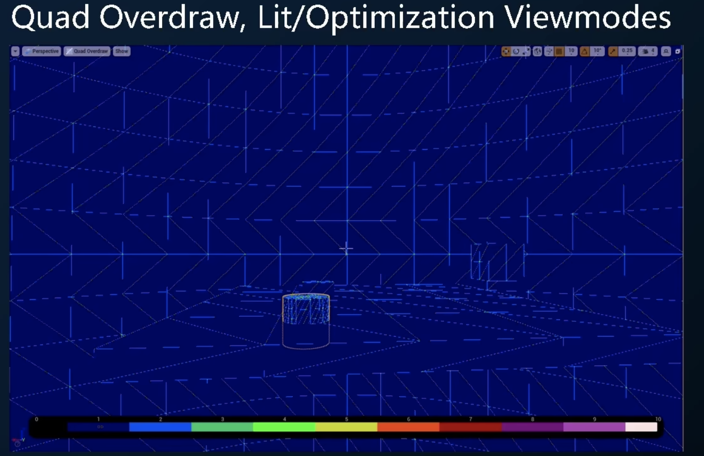

# UE4性能优化

[link](https://www.bilibili.com/video/BV1FV411G72Q/?spm_id_from=333.788&vd_source=946c21f5d056f6b7272a82752dccb078)
难度：:star:
价值：:star::star:

## 准备

环境：
引擎版本：4.27.2
Renderer: deferred
RHI: DirectX12, Thread enabled
Platform: Windows

一些概念：
Cpu Bound下的命令和工具
Gpu Bound下的命令和工具
数据可视化工具
第三方插件
其他辅助

分享目标:
使用频率高
专注UE4的工具集

## 帧数

帧数：全版本适用的工具


帧数：带Console命令的版本

Prims: 屏幕上的面数

几个核心概念：

- Game：游戏主线程，不负责渲染操作。每帧游戏逻辑计算需要的时间。
- Draw(frontend)：渲染线程，为RHI提供跟平台无关的渲染Commands。RenderThread组织Commands的时间。
- RHIT(backend)：RHI线程，解析渲染线程的Commands，调用平台相关的API向CPU发送渲染指令。该线程可手动关闭/取消，相应的工作由RenderThread兼任。
- GPU：通过GPU的Query Time得到执行一系列命令的时间。GPU执行一帧计算消耗的时间。

## Bound

> CPU Bound or GPU Bound？

Game > GPU: CPU Bound
Game < GPU: GPU Bound
Game $\approx$ GPU: 需要进一步判断

- 奇技淫巧：r.screenpercentage [300]
  - 渲染更大的图，增大GPU负担。如果能看出CPU和GPU时间差距明显增大，能判断出Bound
- 正规正统：frontend.exe / insight.exe
  - 虚幻自带工具

### CPU Bound

```stat game```：在运行的viewport上显示比较消耗CPU的分类

```stat uobjects```: 高频命令


```stat slate```: 在运行的viewport上显示比较消耗CPU的Slate(高频，在包里用，编辑器里用会涉及编辑器的slate)


```stat startfile & stat stopfile``` + frontend.exe


其他命令：[link](https://docs.unrealengine.com/4.27/zh-CN/TestingAndOptimization/PerformanceAndProfiling/StatCommands/)

```c++
stat particles
stat foliage // 植被
stat ai
stat audio
stat collision
stat animation
...
stat none // 特殊，用于关闭viewport的显示。一键操作
```

### GPU Bound

```stat GPU```: 在运行终端viewport上显示每帧GPU消耗，按pass消耗从大到小排列

```stat scenerendering // 在运行终端viewport上显示RenderThread的部分细节```

```profilegpu```:


```trace.start gpu```:


RenderDoc:


其他命令：

```c++
stat renderthreadcommands
stat lightrendering
stat shadowrendering
...
```

## 数据可视化工具





## 第三方插件

- DLSS：适合Nvidia显卡，易用
- FSR2：PC平台适合
- XeSS：Intel显卡

## 其他辅助

```freezerendering```: 冻结下一帧渲染的物体列表、Player任可控制

```stat slow```

```help```: 显示console的所有命令
