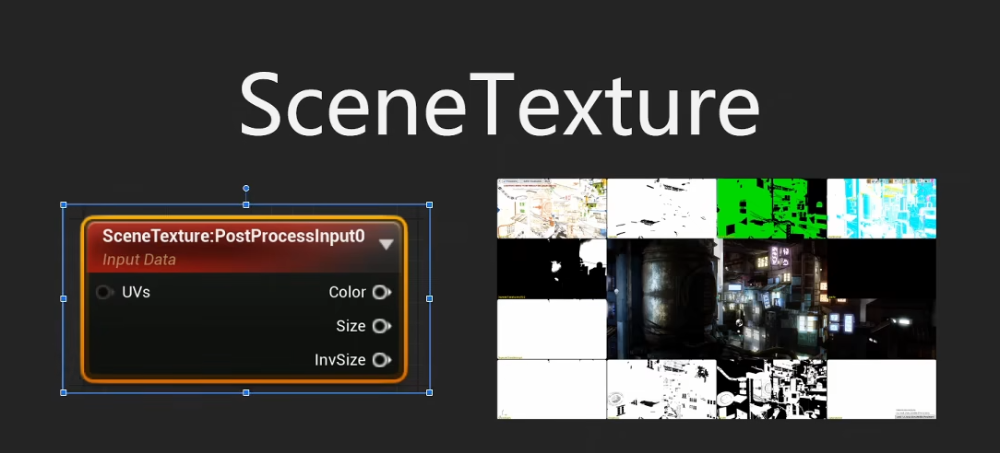

# 后期材质基础

 Epic 贾越

价值 :star::star::star::star::star:

 https://www.bilibili.com/video/BV1Pk4y1R7MN/?vd_source=946c21f5d056f6b7272a82752dccb078

## 上

特殊之处

可以利用虚幻延迟渲染特性，使用G-buffer中的所有信息

SceneTexture中都可以拿到：

ctl+shift+， 打开GPU Visulizer，看怎么渲染一帧

Blend Position

## 场景调色

## 扰动和模糊

扰乱：UV便宜
模糊：采样，合并

## 描边

