# H5+CSS

> 尚硅谷前端入门html+css零基础教程
> <https://www.bilibili.com/video/BV1p84y1P7Z5?p=2>

[toc]

## what is 前端

前端能开发什么？
网页，小程序，数据可视化，大前端(服务器、客户端)

先学习写网页：HTML(HTML4, HTML5) + CSS(CSS2, CSS3)

两位先驱： 图灵， 冯诺依曼

- 应用软件两种架构
  - C/S架构: client/server
    - 需要安装，偶尔更新，不跨平台
    - 大型专业应用、安全性要求高的应用，还要采用C/S架构
    - 英雄联盟、After Effects、航天相关、军事相关
  - B/S架构: browser/server
    - 无需安装，无需更新，跨平台

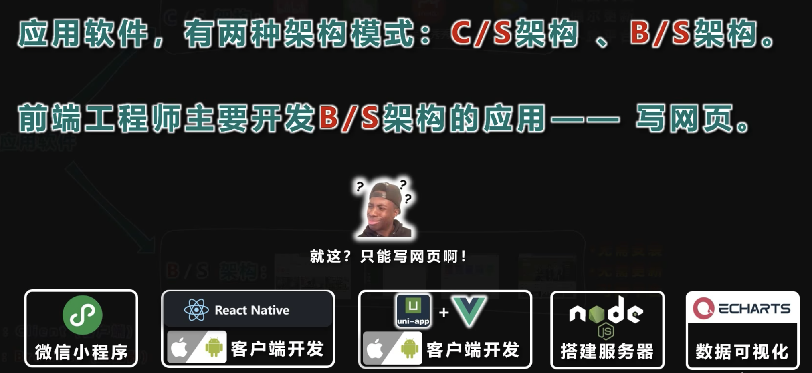

浏览器

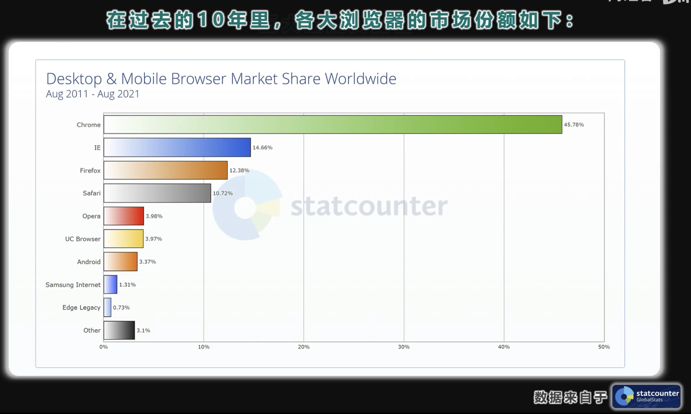

浏览器内核

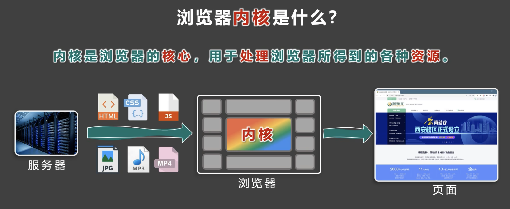
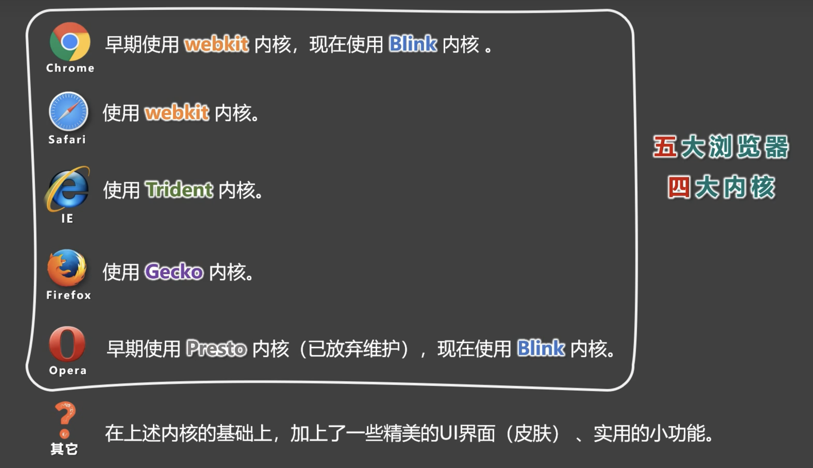

网页

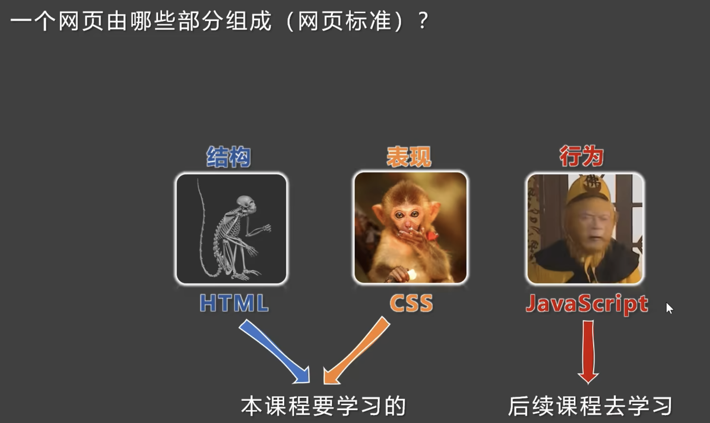

## HTML入门

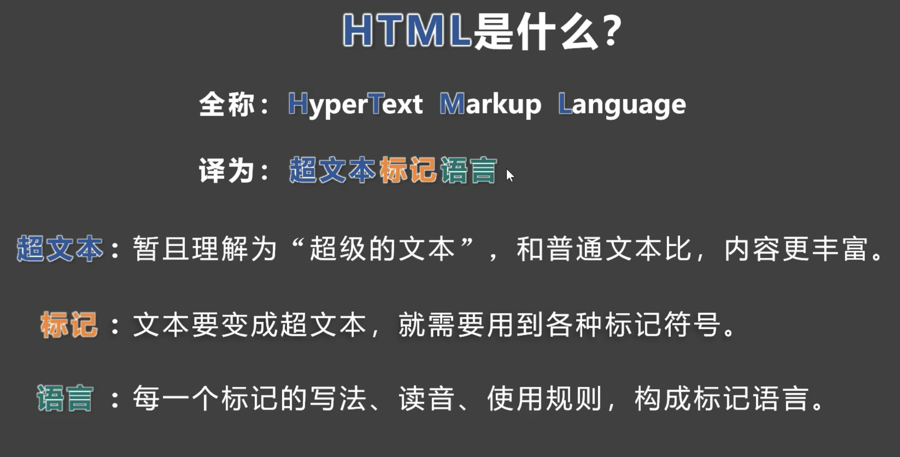

### 发展史

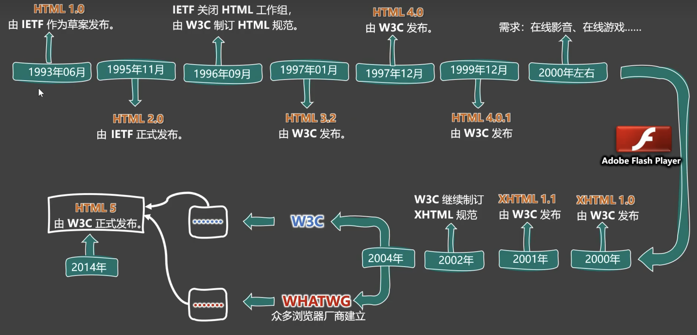

代码编辑器
VSCode

### 字符编码

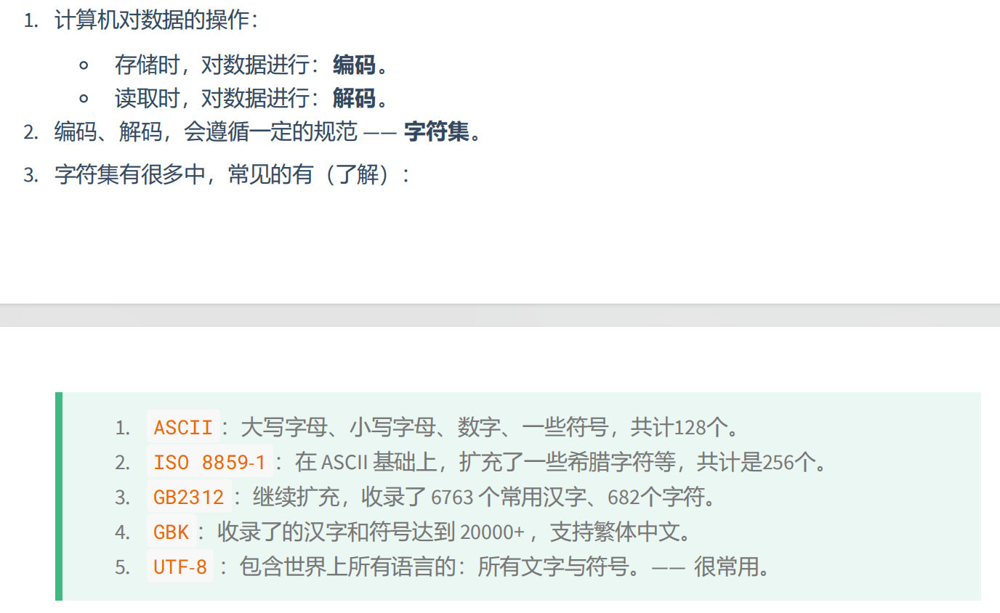

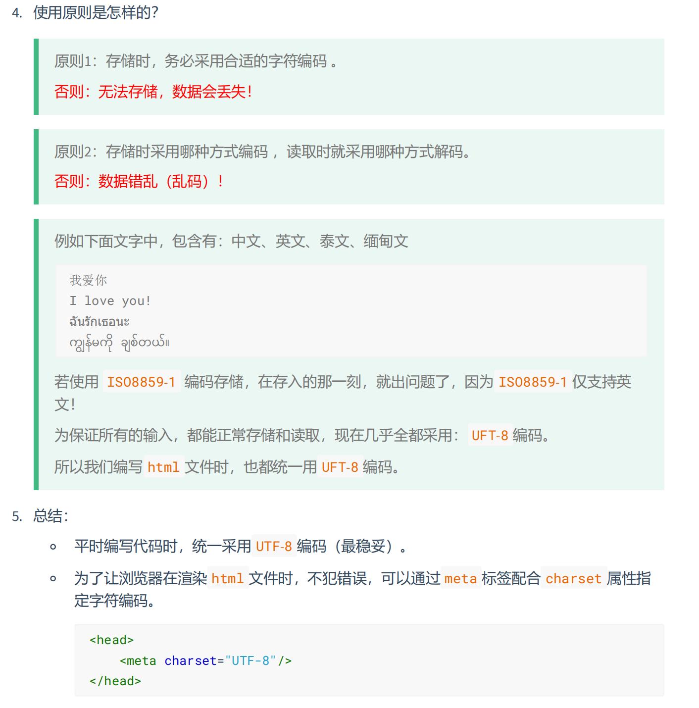

## HTML基础

### 开发者文档

[w3c官网](https://www.w3.org/)
[w3School](https://www.w3school.com.cn/)
[MDN](https://developer.mozilla.org/zh-CN/)

### 标签

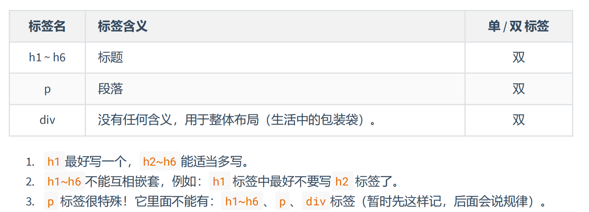

语义化标签：
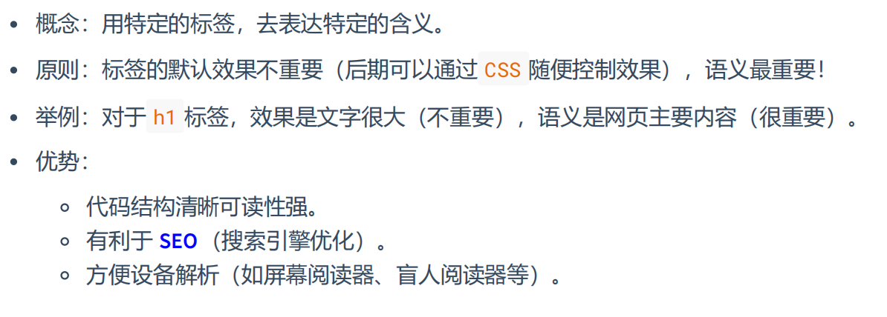

<a href="https://www.bilibili.com/">bilibili</a>

