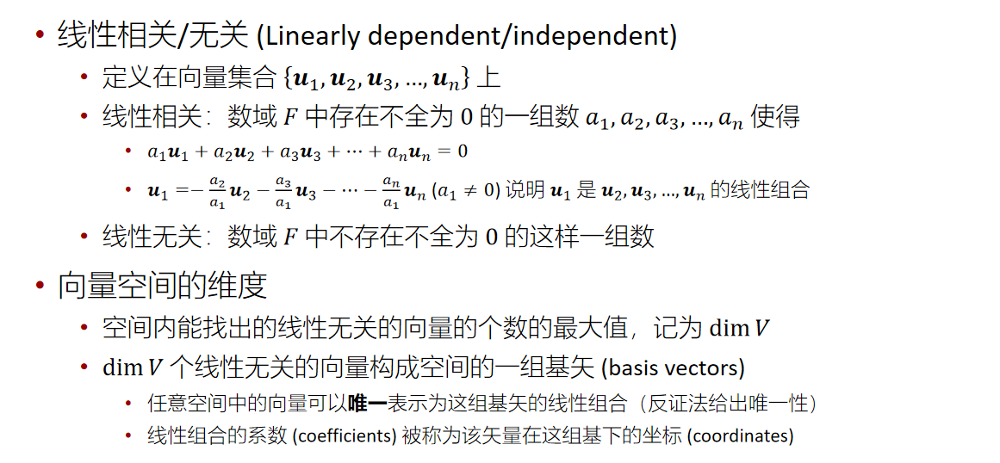
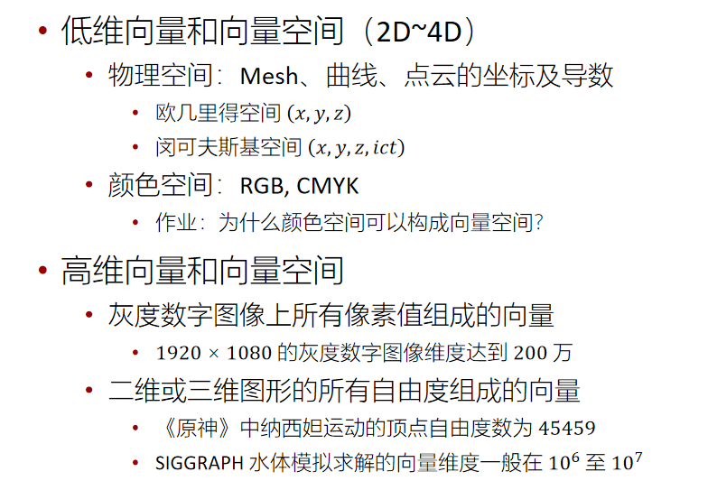
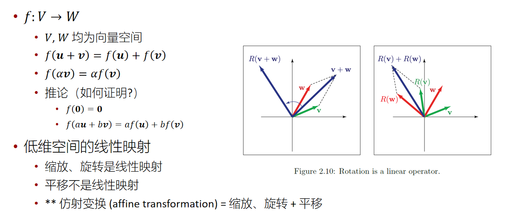
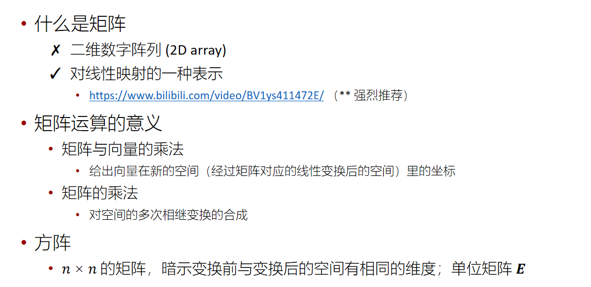
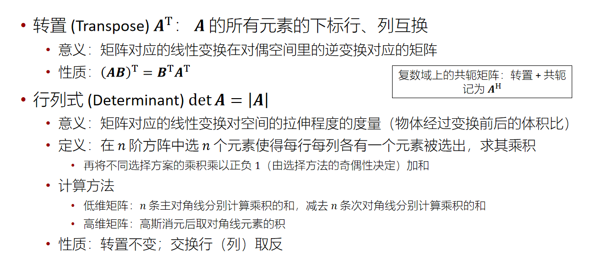
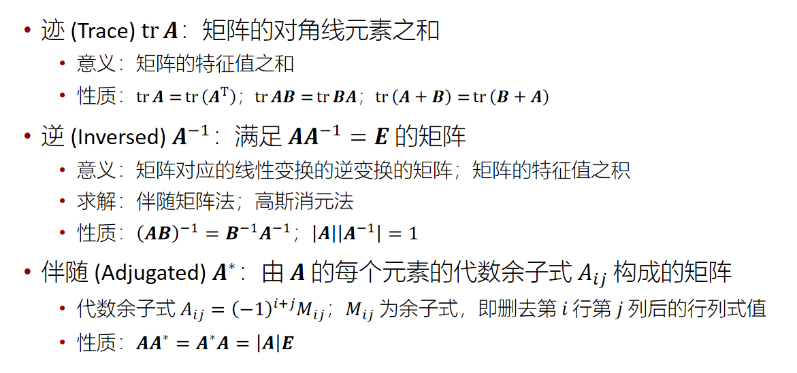

# 线性代数基础

[toc]

## 线性代数基础一

作业：为什么颜色空间可以构成向量空间

### 向量空间 Vector Space

- 数域 F 上的向量空间：带有向量加法和标量乘法的非空集合 V
  - 向量加法结合律：u+(v+w)=(u+v)+w
  - 向量加法交换律：u+v=v+u
  - 向量加法单位元：v+0=v
  - 向量加法逆元：v+(−v)=0
  - 标量乘法与数域乘法的结合律：a(bv)=(ab)v
  - 标量乘法单位元：1v=v
  - 标量乘法对向量加法的分配律：a(u+v)=au+av
  - 标量乘法对数域加法的分配律：(a+b)v=av+bv

- 在图形学应用中，数域 F 一般取为实数域 ℝ，其它选择包括复数域 ℂ 等

### 线性组合 Linear Combiination

### 图形学研究的维度

### 线性映射 (Linear Mapping)

### 矩阵 (Matrix)

https://www.bilibili.com/video/BV1ys411472E/?vd_source=946c21f5d056f6b7272a82752dccb078

### 矩阵单目运算

逐渐看不懂了，先去看线代课吧

