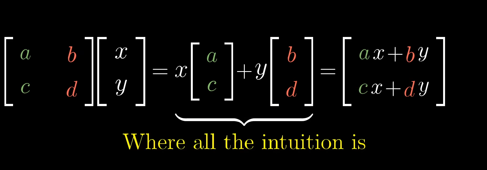
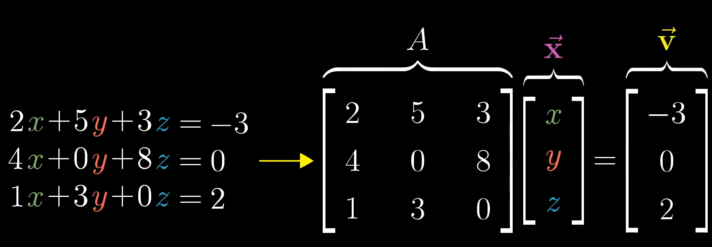
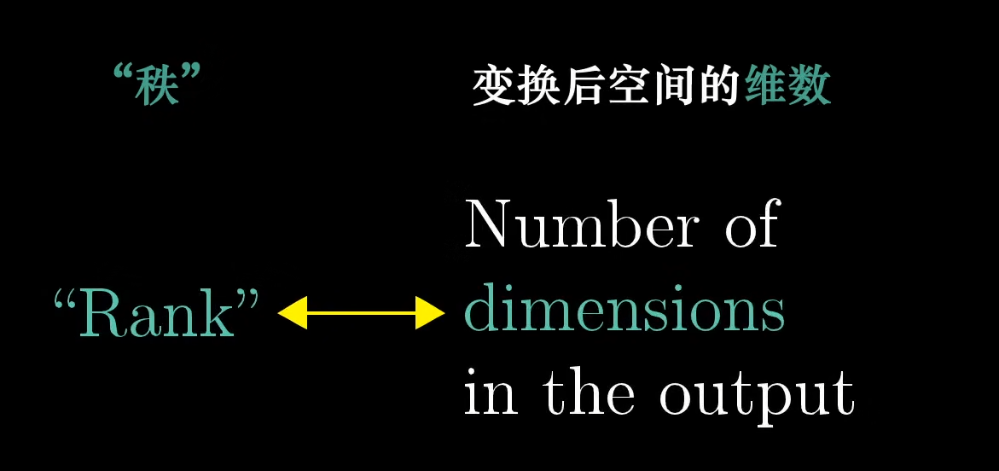
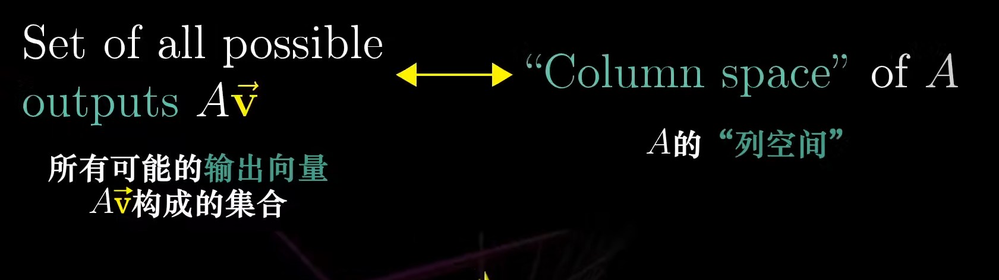
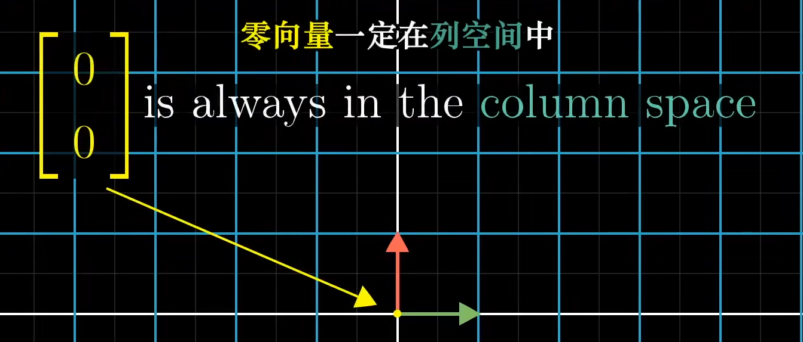
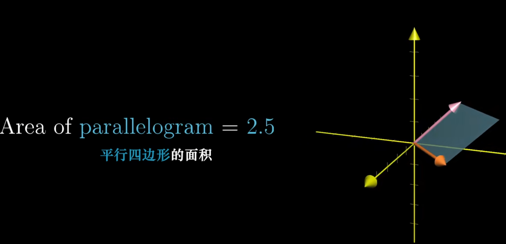
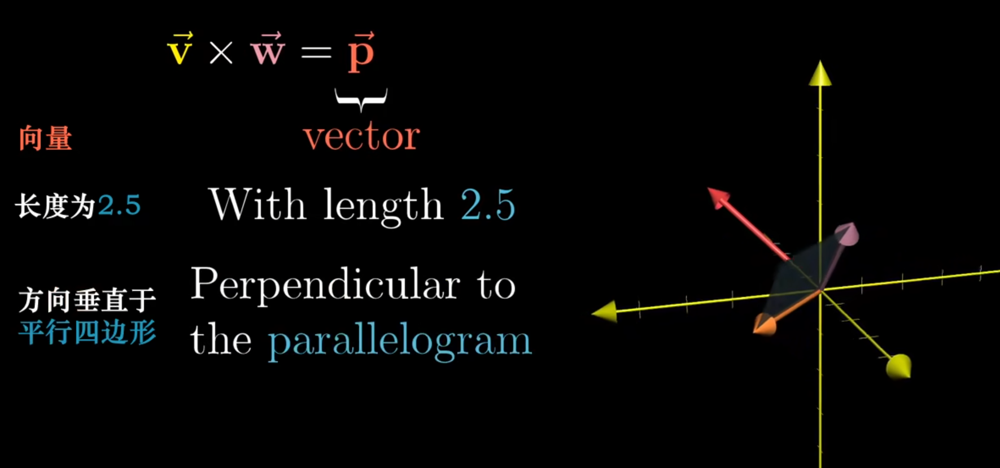
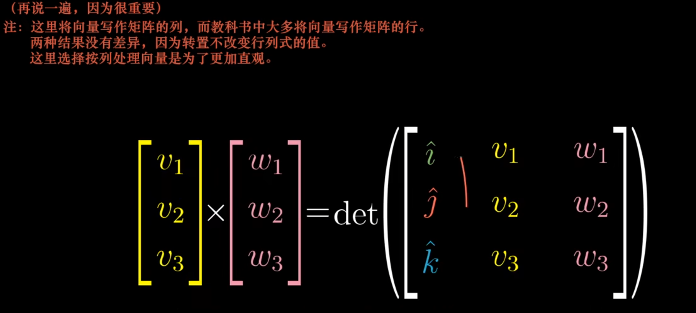
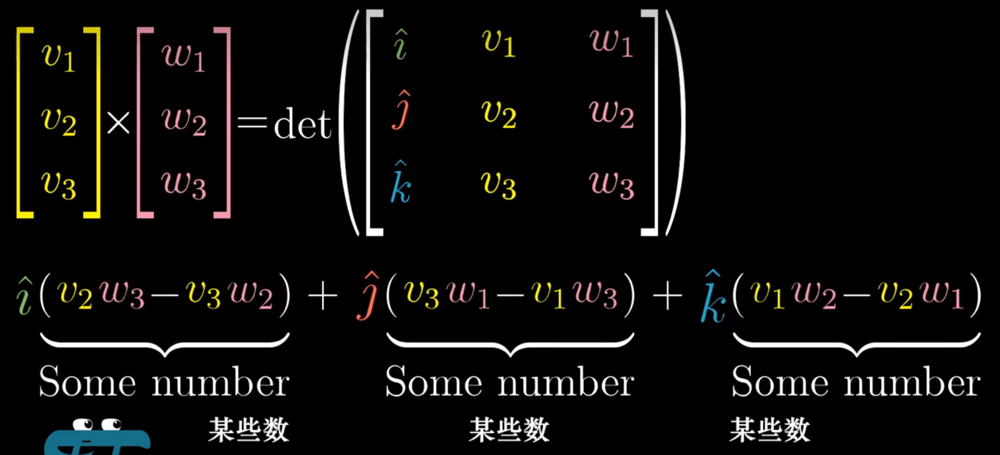

# 线性代数的本质

b站up：3Blue1Brown

[toc]

## 向量究竟是什么

## 线性组合、张成的空间与基

## 矩阵与线性变换

## 矩阵乘法与线性变换复合

## 行列式

the determinant of a transformation

二维：面积缩放
三维：体积缩放

## 逆矩阵、列空间与零空间

 

## 点积与对偶性

## 叉积

